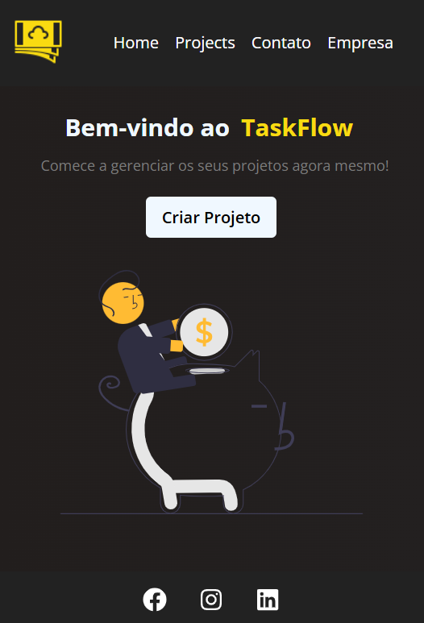

<h1 align="center"> Project-Manager 💻</h1>

  <a href="#objective">Objective</a> •
  <a href="#technologies">Technologies</a> •
  <a href="#about-me">About me</a> 

  <table>
  <tr>
    <td>
      <h4><em>Mobile Main Page</em></h4>
      
    </td>
    <td>
      <h4><em>Mobile Project Page</em></h4>
      
    </td>
  </tr>
</table>

<table>
      <td>
        <h4><em>Desktop Main Page</em></h4>
        
      </td>
    </tr>
    </table>
    <table>
    <tr>
      <td>
        <h4><em>Desktop Project Page</em></h4>
        
      </td>
      </tr>
      </table>
      <table>
      <tr>
      <td>
        <h4><em>Desktop Contact Page</em></h4>
        
      </td>
    </tr>
    <tr>
      <td>
        <h4><em>Desktop Company Page</em></h4>
        
      </td>
    </tr>
  </table>
 

<h2 id="objective">Objective 🎯</h2>

This project is a Project Manager application designed to help users efficiently create and manage their projects. With it, you can create new projects, specify the project’s area, allocate a budget, and manage various other details.

The application was built using React for the front end, implementing dynamic components, state management, and custom routing to navigate between pages. Node.js + Express for the back end, I learned and applied fundamental server-side concepts, running everything locally during development. The data is stored in MongoDB, with MongoDB Atlas serving as the cloud database solution, ensuring scalability and easy access to stored information.

In addition to React and back-end development, I also applied HTML and CSS to structure and style the application, making it both functional and visually appealing.

This project allowed me to strengthen my understanding of full-stack development, from building interactive user interfaces to working with databases and integrating different technologies into a single application.

You can access the preview of this project at this <a href="https://project-manager-git-main-brunos-projects-7c5d064a.vercel.app/">link</a>

<h2 id="technologies">Technologies ⚡</h2>
<ul>
<li><a href="https://react.dev/">React.js</a></li>
  <li><a href="https://developer.mozilla.org/en-US/docs/Web/JavaScript/Reference">JavaScript</a></li>
  <li><a href="https://developer.mozilla.org/pt-BR/docs/Glossary/Node.js">Node.js</a></li>
  <li><a href="https://www.mongodb.com/pt-br/docs/">MongoDB</a></li>
  <li><a href="https://developer.mozilla.org/en-US/docs/Web/HTML">HTML</a></li>
  <li><a href="https://developer.mozilla.org/en-US/docs/Web/CSS">CSS</a></li>
</ul>

<h2 id="about-me">About me 👨🏻</h2>

My name is Bruno Henrique, I am 18 years old and I was born and raised in Brazil. I'm looking for my first opportunity in the web development, focusing on the JavaScript stack. I'm training my skills in React.js, Node.js, MongoDB, Javascript, HTML5 and CSS3.